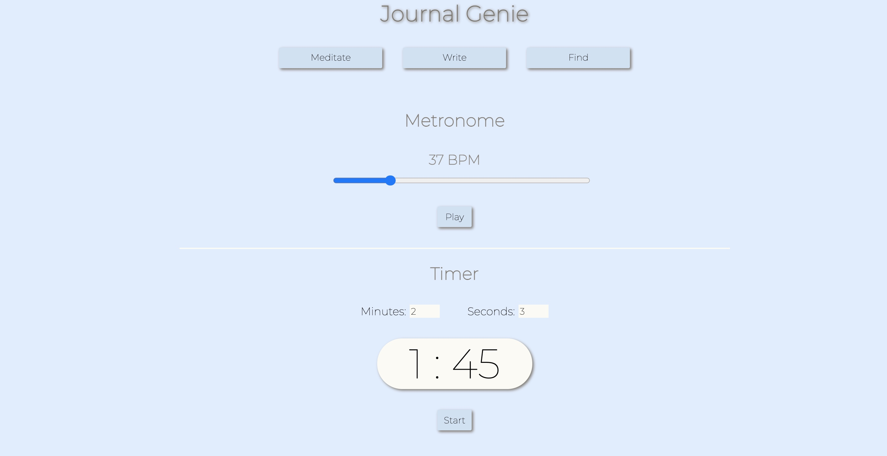

[](https://shields.io/)
[](https://shields.io/)
[](https://shields.io/)

# JournalGenie

A meditation/journal app designed for a relaxing and seamless user experience.

## Screen Shot
### Landing Page


### Journal Entry


### Meditation Tools


## Installation

Use the package manager [npm](https://www.npmjs.com/get-npm) to install Journal Genie.

```bash
npm install
mysql -u {USERNAME} -p {PASSWORD} < db/schema.sql
npm start
```

## Demo:
Head to localhost:3000 in browser

## Features
- Meditation Tools
  - Metronome
  - Timer
- Journal Entries with persisting data
- Previous Entries
  - Review past entries and search by keyword, date, or both


## Author
| Name                | Github                            | LinkedIn                                     |
| --------------------|:------------------------------:   |------:|
| Patrick McConnell   |https://github.com/pmcconnell13    |www.linkedin.com/in/charlespatrickmcconnell   |


